# Bookish

A new Flutter project for book lovers.

## 🚀What are the steps?

### Login

 
  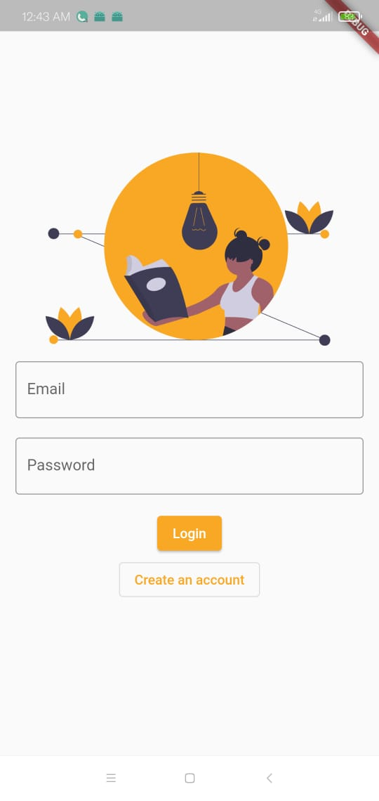
  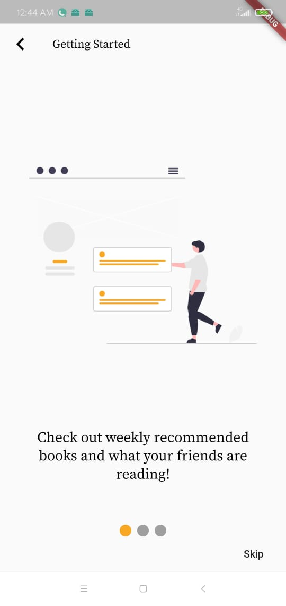
  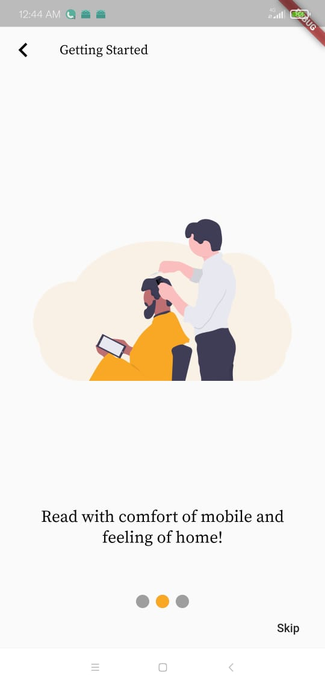
  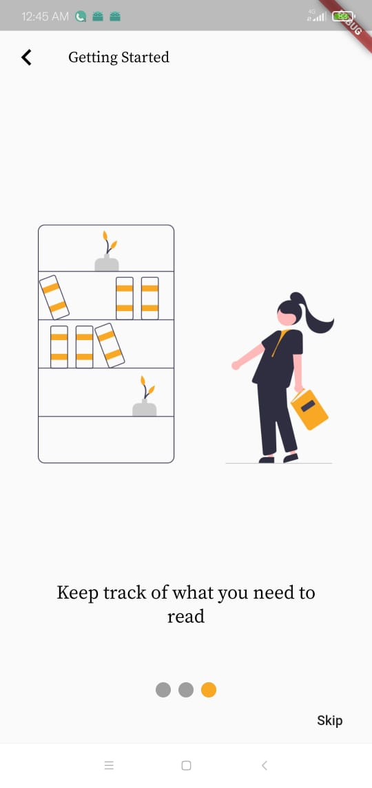

### Feed

 
  

 
  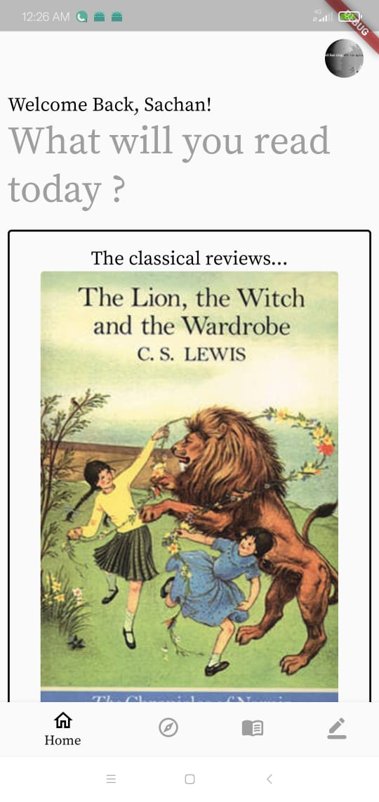
  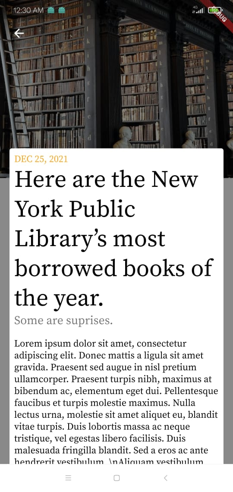
  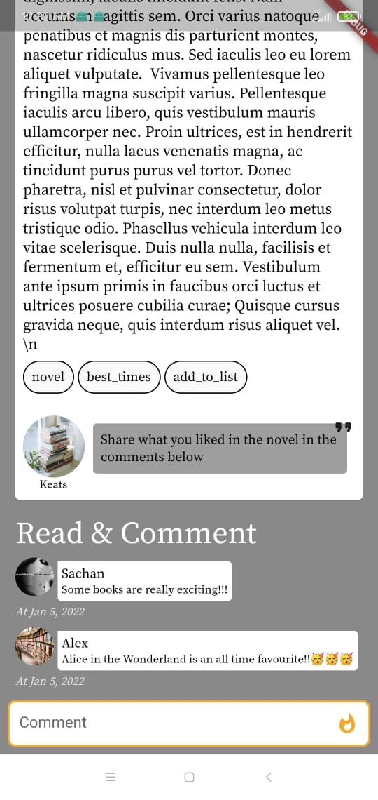

### Explore

 
  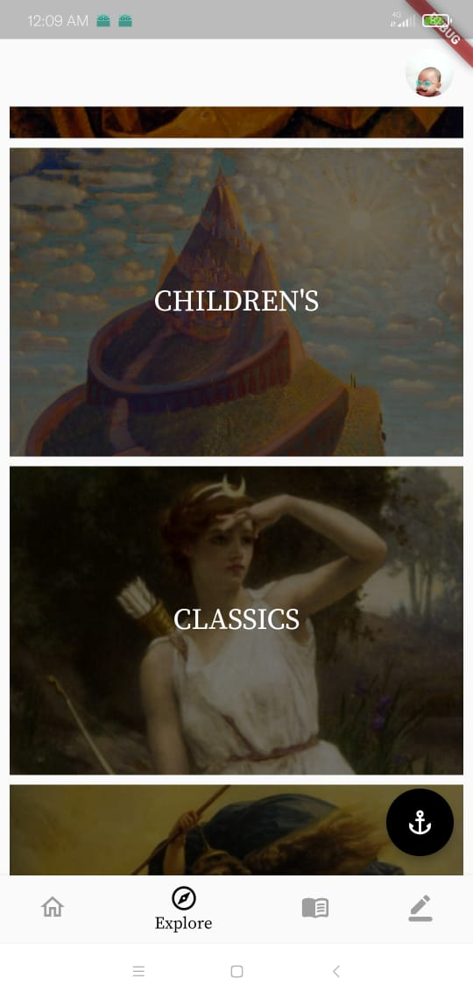
  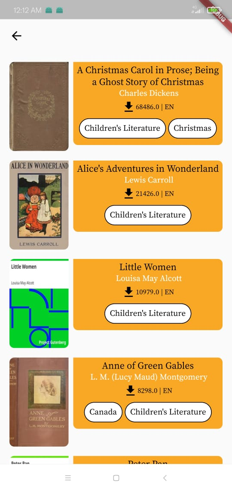
  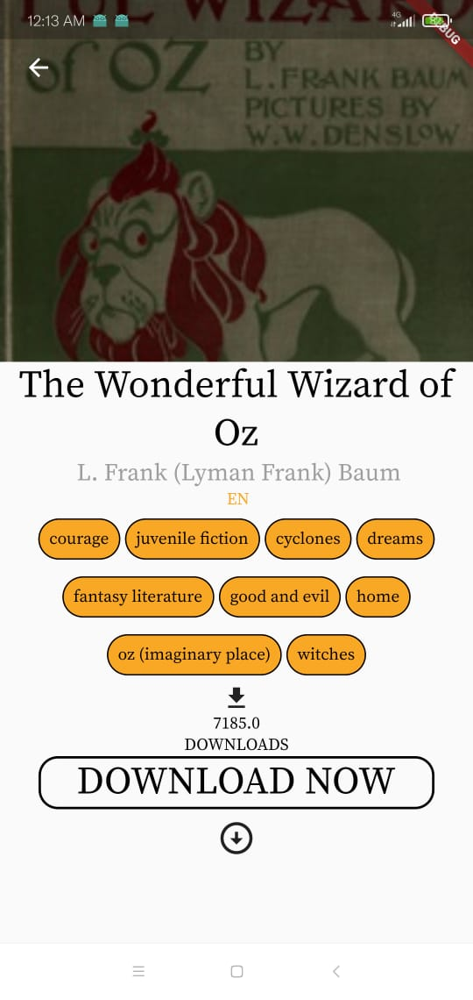
  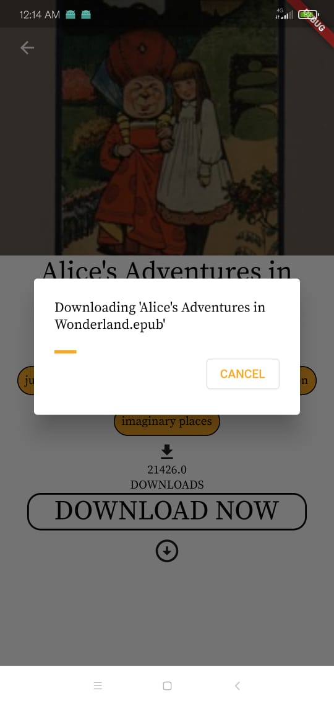
  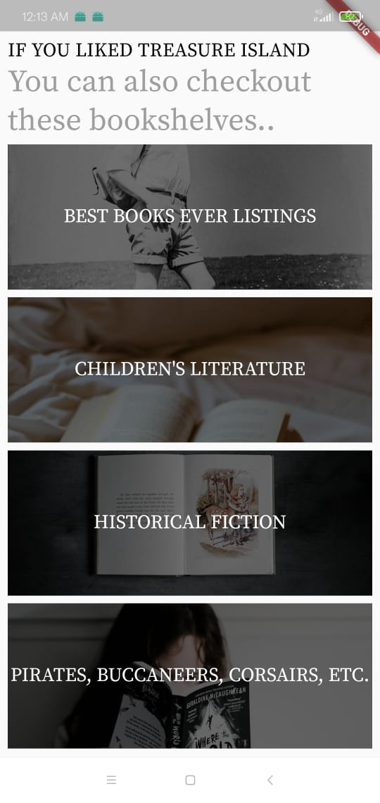
  

### Read

 
  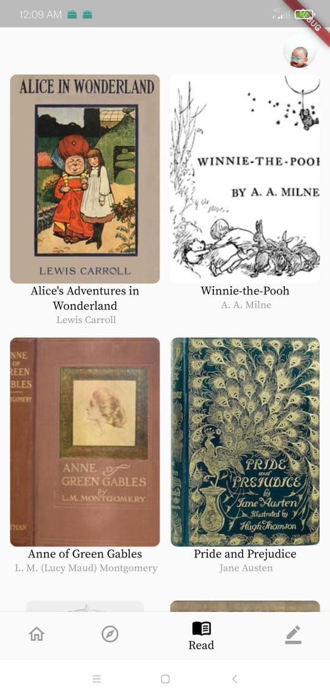
   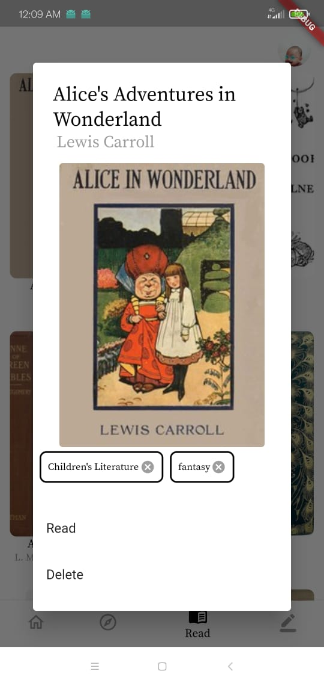
   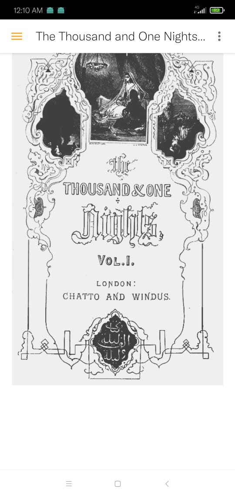

### Recommend

 
  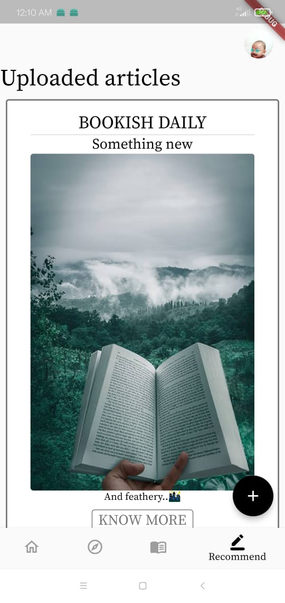
   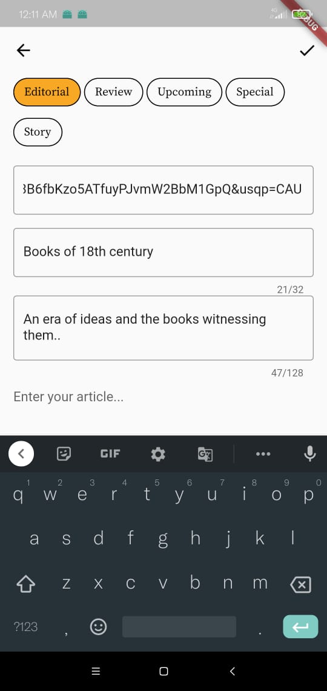

And enjoy the journey of public domain ebooks..

## 💻 Contribution
Go over the issues section and solve any bug that interests you or suggest any changes or new features.
